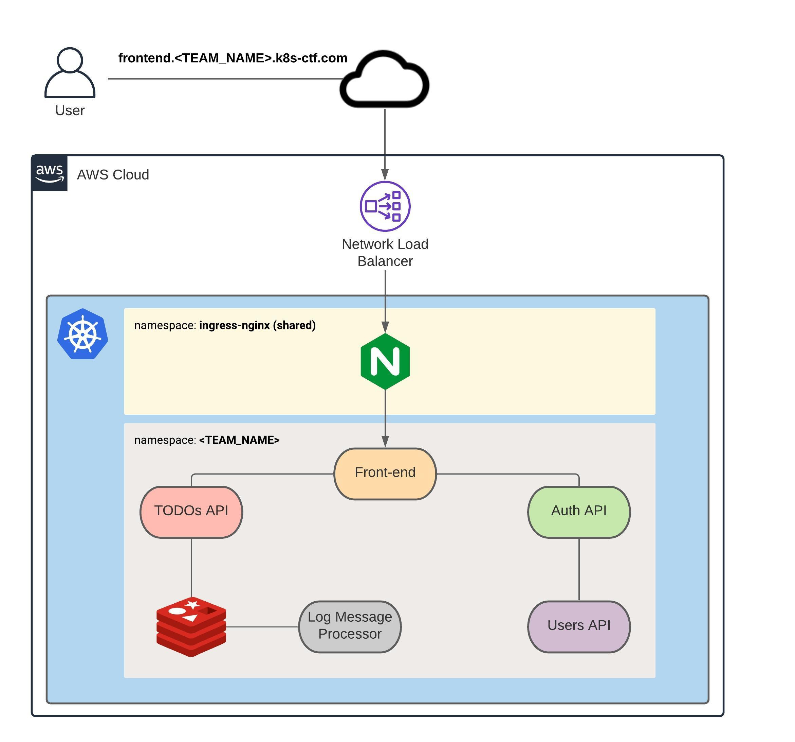
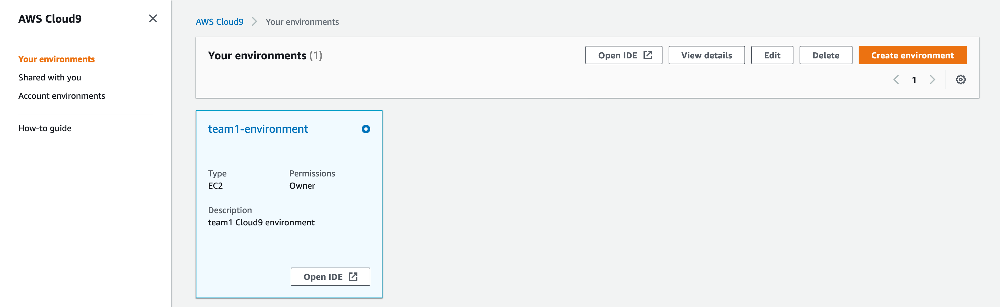
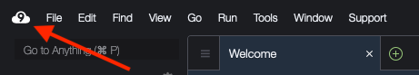
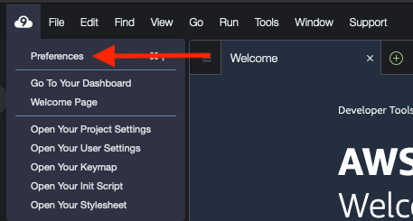
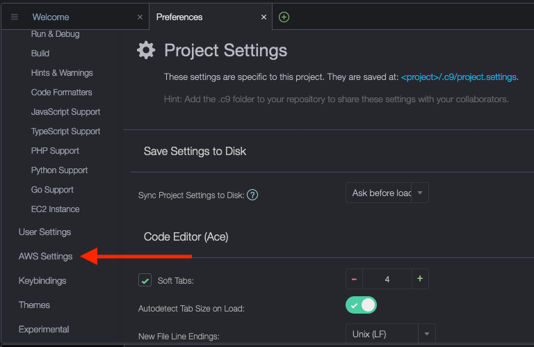
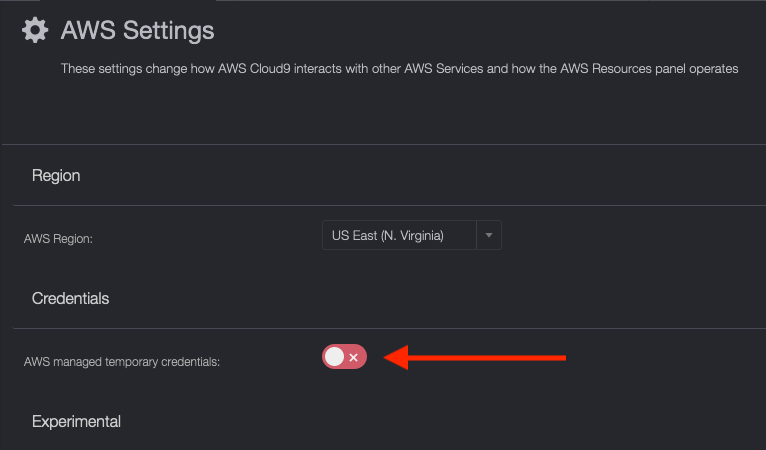
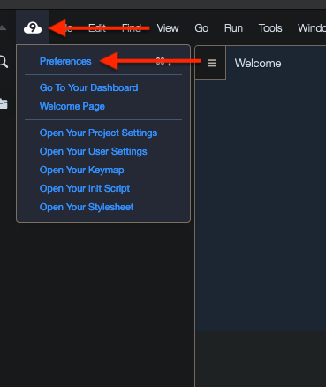
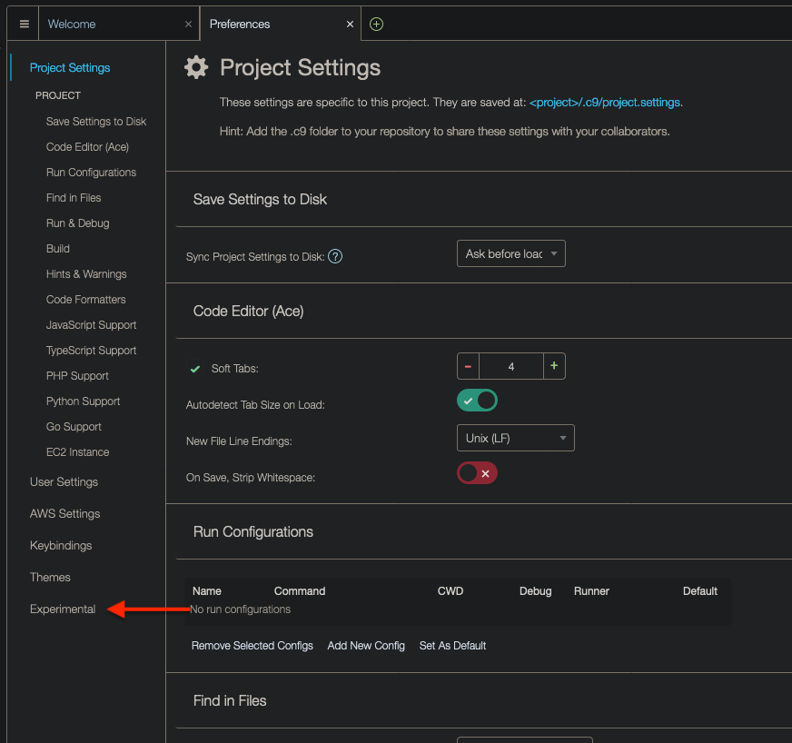
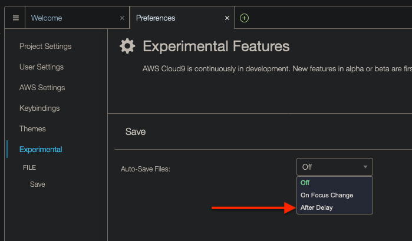

# Kubernetes CTF

# Table Of Content

- [Getting Started](#getting-started)
  * [Introduction (1 Point)](#introduction-1-point)
    + [Rules](#rules)
    + [Architecture](#architecture)
    + [Capture The Flag](#capture-the-flag)
  * [Accessing The Cluster (2 Points)](#accessing-the-cluster-2-points)
    + [Accessing the AWS Console (Cloud9 Users Only)](#accessing-the-aws-console-cloud9-users-only)
      - [Accessing your Cloud9 Environment (Cloud9 Users Only)](#accessing-your-cloud9-environment-cloud9-users-only)
      - [Disable Temporary Credentials (REQUIRED) (Cloud9 Users Only)](#disable-temporary-credentials-required-cloud9-users-only)
      - [Enabling Auto-Save (optional) (Cloud9 Users Only)](#enabling-auto-save-optional-cloud9-users-only)
      - [Installing kubectl (Cloud9 Users Only)](#installing-kubectl-cloud9-users-only)
    + [Configuring The AWS CLI (Local Machine and Cloud9 Users)](#configuring-the-aws-cli-local-machine-and-cloud9-users)
    + [Configuring kubectl (Local Machine and Cloud9 Users)](#configuring-kubectl-local-machine-and-cloud9-users)
    + [Cloning The Application Repository (Local Machine and Cloud9 Users)](#cloning-the-application-repository-local-machine-and-cloud9-users)
    + [Capture The Flag](#capture-the-flag-1)
- [Section 1: Building Docker Images (500 Points)](#section-1-building-docker-images-500-points)
  * [Introduction (1 Point)](#introduction-1-point--1)
    + [Capture The Flag](#capture-the-flag-2)
  * [Front-End (99 Points)](#front-end-99-points)
    + [Capture The Flag](#capture-the-flag-3)
  * [Auth API (103 Points)](#auth-api-103-points)
    + [Capture The Flag](#capture-the-flag-4)
  * [TODOs API (99 Points)](#todos-api-99-points)
    + [Capture The Flag](#capture-the-flag-5)
  * [Users API (99 Points)](#users-api-99-points)
    + [Capture The Flag](#capture-the-flag-6)
  * [Log Message Processor (99 Points)](#log-message-processor-99-points)
    + [Capture The Flag](#capture-the-flag-7)
- [Section 2: Pushing Docker Images to Amazon ECR Repositories (1000 Points)](#section-2-pushing-docker-images-to-amazon-ecr-repositories-1000-points)
  * [Introduction (5 Points)](#introduction-5-points)
    + [Capture The Flag](#capture-the-flag-8)
  * [Front-End (199 Points)](#front-end-199-points)
    + [Capture The Flag](#capture-the-flag-9)
  * [Auth API (199 Points)](#auth-api-199-points)
    + [Capture The Flag](#capture-the-flag-10)
  * [TODOs API (199 Points)](#todos-api-199-points)
    + [Capture The Flag](#capture-the-flag-11)
  * [Users API (199 Points)](#users-api-199-points)
    + [Capture The Flag](#capture-the-flag-12)
  * [Log Message Processor (199 Points)](#log-message-processor-199-points)
    + [Capture The Flag](#capture-the-flag-13)
  * [Hints](#hints)
    + [Building the name of the Docker image (20 Points)](#building-the-name-of-the-docker-image-20-points)
- [Section 3: Deploying Microservices to Kubernetes (2000 Points)](#section-3-deploying-microservices-to-kubernetes-2000-points)
  * [Introduction (5 Points)](#introduction-5-points-1)
    + [Capture The Flag](#capture-the-flag-14)
  * [Front-End (398 Points)](#front-end-398-points)
    + [Capture The Flag](#capture-the-flag-15)
  * [Auth API (398 Points)](#auth-api-398-points)
    + [Capture The Flag](#capture-the-flag-16)
  * [TODOs API (400 Points)](#todos-api-400-points)
    + [Capture The Flag](#capture-the-flag-17)
  * [Users API (399 Points)](#users-api-399-points)
    + [Capture The Flag](#capture-the-flag-18)
  * [Log Message Processor (400 Points)](#log-message-processor-400-points)
    + [Capture The Flag](#capture-the-flag-19)
- [Section 4: Configuring Environment Variables with ConfigMaps and Secrets (1500 Points)](#section-4-configuring-environment-variables-with-configmaps-and-secrets-1500-points)
  * [Introduction (5 Points)](#introduction-5-points-2)
    + [Capture The Flag](#capture-the-flag-20)
  * [Front-end (250 Points)](#front-end-250-points)
    + [Capture The Flag](#capture-the-flag-21)
  * [Auth API (339 Points)](#auth-api-339-points)
    + [Capture The Flag](#capture-the-flag-22)
  * [TODOs API (299 Points)](#todos-api-299-points)
    + [Capture The Flag](#capture-the-flag-23)
  * [Users API (308 Points)](#users-api-308-points)
    + [Capture The Flag](#capture-the-flag-24)
  * [Log Message Processor (299 Points)](#log-message-processor-299-points)
    + [Capture The Flag](#capture-the-flag-25)
  * [Hints](#hints-1)
    + [How the data portion in a Secret looks like (50 Points)](#how-the-data-portion-in-a-secret-looks-like-50-points)
- [Section 5: Deploying Redis (500 Points)](#section-5-deploying-redis-500-points)
  * [Redis (500 Points)](#redis-500-points)
    + [Capture The Flag](#capture-the-flag-26)
- [Section 6: Deploying Services (3000 Points)](#section-6-deploying-services-3000-points)
  * [Introduction (5 Points)](#introduction-5-points-3)
    + [Capture The Flag](#capture-the-flag-27)
  * [Front-end (379 Points)](#front-end-379-points)
    + [Capture The Flag](#capture-the-flag-28)
  * [Auth API (379 Points)](#auth-api-379-points)
    + [Capture The Flag](#capture-the-flag-29)
  * [TODOs API (379 Points)](#todos-api-379-points)
    + [Capture The Flag](#capture-the-flag-30)
  * [Users API (379 Points)](#users-api-379-points)
    + [Capture The Flag](#capture-the-flag-31)
  * [Redis (379 Points)](#redis-379-points)
    + [Capture The Flag](#capture-the-flag-32)
- [Section 7: Configuring Ingress For The Front-End (6000 Points)](#section-7-configuring-ingress-for-the-front-end-6000-points)
  * [Introduction (5 Points)](#introduction-5-points-4)
    + [Capture The Flag](#capture-the-flag-33)
  * [Front-end (5995 Points)](#front-end-5995-points)
    + [Ingress Classes](#ingress-classes)
    + [Name-based Virtual Hosting](#name-based-virtual-hosting)
    + [Requirements](#requirements)
    + [Capture The Flag](#capture-the-flag-34)
- [Section 8: Securing the Cluster with Network Policies (10000 Points)](#section-8-securing-the-cluster-with-network-policies-10000-points)
  * [Deploying Network Policies (10000 Points)](#deploying-network-policies-10000-points)
    + [Frontend](#frontend)
    + [Auth API](#auth-api)
    + [TODOs API](#todos-api)
    + [Users API](#users-api)
    + [Log Message Processor](#log-message-processor)
    + [Redis](#redis)
    + [Capture The Flag](#capture-the-flag-35)
    + [Hint](#hint)
      - [The missing egress rule (4000 Points)](#the-missing-egress-rule-4000-points)

# Getting Started

## Introduction (1 Point)

In this Kubernetes CTF, you will deploy a TODO application, comprised of 5 [microservices](https://microservices.io/), to a Kubernetes cluster running on AWS. The final solution, which is represented by the diagram below, will be broken down into multiple tasks and each task will award you points if all steps are executed correctly. As previously mentioned, you will need to install in your system the [AWS CLI](https://docs.aws.amazon.com/cli/latest/userguide/cli-chap-install.html), the [Kubernetes command-line tool](https://kubernetes.io/docs/tasks/tools/install-kubectl/) (kubectl) and [Docker](https://docs.docker.com/get-docker/).

This challenge has been tested with the following versions of the AWS CLI and kubectl:

* AWS CLI -> 1.18 and later
* kubectl -> v1.20.0

**We will not be providing support to versions different than what's covered above.**

### Rules

We expect all teams to abide by the following rules:

* **Do not** deploy more than 8 Pods in your team's namespace. This is a hard limit we configured in the cluster. If a team deploys more than 8 Pods in an attempt to compromise the quality of the event, the team might be disqualified.
* **Do not** disrespect any of your teammates. We have a zero-tolerance policy for any harassment of our attendees for any reason (age, religious beliefs, or sexual identity and orientation, etc) 
* **Do** treat each other with the utmost kindness, tolerance, and respect. Kubernetes is a complex system so leave the competition aspect aside and help your teammates.
* **Do** have fun!

### Architecture

Here's the diagram of the solution you will be building in this competition:



In summary:

* There will be 6 microservices: Front-end, Auth API, TODOs API, Users API, Log Message Processor and Redis
* The Front-end will be the only public microservice and will sit behind an nginx server, which will be served traffic by an AWS Network Load Balancer
* The nginx server will be shared among all teams
* Each microservice should be configured through environment variables
* The communication between any two microservices should be private (i.e. it can't traverse the Internet)
* The lines between the microservices in the diagram above represent the direction of the traffic allowed. If two microservices are not linked by a line (e.g. Front-end and Redis), that means traffic between these microservices should be denied.

### Capture The Flag

> *Read what [Capture The Flag](https://dev.to/atan/what-is-ctf-and-how-to-get-started-3f04) is if you're not familiar with the term.*

During this competition, you will have to capture and submit multiple "flags", which are secrets that will be revealed or will need to be calculated after successfully executing all steps of each one of the tasks. For each obtained flag, you will have to submit it using the following format:

```
DevSlopCTF{FLAG}
```

**PS: please note that all flags are case sensitive, meaning that uppercase and lowercase letters are NOT the same.**

After submitting the correct flag, you will earn points (each task will award you different amount of points). Let's submit the first flag of the competition so you know how it works. 

The first flag is: `ok`. Type in `DevSlopCTF{ok}` in the text field below and click submit to earn **1 point**.

## Accessing The Cluster (2 Points)

**PS: If you're using Cloud9, follow from the "Accessing the AWS Console" section. If you're using your local machine, skip to "Configuring The AWS CLI" section**

### Accessing the AWS Console (Cloud9 Users Only)

To access the AWS Console, take a look at your Discord team channel name and find out your team number (e.g. team1, team2, team3 etc). Then [Click here to sign in to AWS](https://k8s-ctf.signin.aws.amazon.com/console)

Your IAM User and its password will be provided to you via your team channel on Discord.

#### Accessing your Cloud9 Environment (Cloud9 Users Only)

We've set up a [Cloud9 environment](https://aws.amazon.com/cloud9/) for the teams that requested it. After you've logged in to AWS, click on **Services** at the top and type in `Cloud9`. That will take you to the Cloud9 console. You should see your team's environment (team1 has been used as example only):



Click on **Open IDE**.

#### Disable Temporary Credentials (REQUIRED) (Cloud9 Users Only)

You won't be able to configure the AWS CLI properly unless you disable temporary credentials. Follow the steps below:

Click on the Cloud9 logo:



Then Preferences:



Scroll down until you find the AWS Settings:



Then make sure it's disabled (you should see the switch go red with an X on the right-hand side):



#### Enabling Auto-Save (optional) (Cloud9 Users Only)

To configure Cloud9 to save files automatically, do the following. Click on the Cloud9 icon on the top-left corner and then on Preferences:



At the bottom, click on Experimental:


Finally, click on drop down and then on `After Delay`, which will cause files to be saved after a second or so:


#### Installing kubectl (Cloud9 Users Only)

To install `kubectl` in your Cloud9 environment, open up the terminal and run the following commands:

```
curl -LO https://dl.k8s.io/release/v1.20.0/bin/linux/amd64/kubectl
chmod +x kubectl 
sudo mv kubectl /usr/bin
```

To verify it was correctly installed, run:

```
kubectl version
```

Make sure the Client version is v1.20.0

### Configuring The AWS CLI (Local Machine and Cloud9 Users)

To access your Kubernetes cluster, you will first need to configure the AWS CLI. Make sure the AWS CLI is installed by running the following command in your terminal:

```
aws --version
```

For the purpose of this challenge, you should use the AWS CLI **version 1.18.* or later**.

To configure the AWS CLI, run:

```
aws configure --profile <TEAM_NAME>
```

Where `<TEAM_NAME>` should be the name of your team (`team1`, `team2`, `team3` etc). The command above will ask for 4 things:

* The **AWS Access Key ID** (which was given to you)
* The **AWS Secret Access Key** (which was given to you)
* The **Default region name** which should **us-east-1**
* The **Default output format** which should be **json**

Once that's done, [export an environment variable](https://docs.aws.amazon.com/cli/latest/userguide/cli-configure-envvars.html) called `AWS_PROFILE` and set it to `<TEAM_NAME>`. For example, for Linux or macOS, you would run `export AWS_PROFILE=<TEAM_NAME>`. Check the hyperlink in this paragraph to learn how to export an environment variable using the Windows Command Prompt or Powershell.

To verify you've correctly configured the CLI, run the following command and take a look at the output:

```
aws sts get-caller-identity --profile <TEAM_NAME>
{
    "UserId": "XXXXXXXXXXXXXXXXXXXX",
    "Account": "111111111111",
    "Arn": "arn:aws:iam::111111111111:user/<TEAM_NAME>"
}
```

If you've configured the CLI correctly, the output should've returned a JSON object showing your User ID (**which is different than the AWS Access Key ID provided to you**), the account number and the Amazon Resource Name (a.k.a ARN) of your IAM User.

### Configuring kubectl (Local Machine and Cloud9 Users)

Next, you will need to generate a configuration file called `kubeconfig`. Typically, this file lives in the `$HOME/.kube` directory. Let's see how we can generate a kubeconfig file.

The Kubernetes cluster you will be interacting with is running on AWS (we are using AWS EKS for this competition). To generate the `kubeconfig` file, you will need to run a command using the AWS CLI. In your terminal, run the following command:

```
aws eks --region us-east-1 update-kubeconfig --name kubernetes-ctf-cluster
```

The command above should have generated the file `$HOME/.kube/config`, which looks similar to this:

```yaml
apiVersion: v1
clusters:
- cluster:
    certificate-authority-data: <CERTIFICATE_AUTHORITY_DATA>
    server: <EKS_URL>
  name: arn:aws:eks:us-east-1:<AWS_ACCOUNT_ID>:cluster/kubernetes-ctf-cluster
contexts:
- context:
    cluster: arn:aws:eks:us-east-1:<AWS_ACCOUNT_ID>:cluster/kubernetes-ctf-cluster
    user: arn:aws:eks:us-east-1:<AWS_ACCOUNT_ID>:cluster/kubernetes-ctf-cluster
  name: arn:aws:eks:us-east-1:<AWS_ACCOUNT_ID>:cluster/kubernetes-ctf-cluster
current-context: arn:aws:eks:us-east-1:<AWS_ACCOUNT_ID>:cluster/kubernetes-ctf-cluster
kind: Config
preferences: {}
users:
- name: arn:aws:eks:us-east-1:<AWS_ACCOUNT_ID>:cluster/kubernetes-ctf-cluster
  user:
    exec:
      apiVersion: client.authentication.k8s.io/v1alpha1
      args:
      - --region
      - us-east-1
      - eks
      - get-token
      - --cluster-name
      - kubernetes-ctf-cluster
      command: aws
      env:
      - name: AWS_PROFILE
        value: <TEAM_NAME>
```

Don't worry too much about the contents of the file. To test you gained access to the cluster, run:

```
kubectl get pods -n <TEAM_NAME>
```

The expected output should be `No resources found in <TEAM_NAME> namespace.`. If you got an error, let one of the organizers know.

### Cloning The Application Repository (Local Machine and Cloud9 Users)

We've already set up a repository with all the application code. Clone the following repository anywhere in your system: [https://github.com/thedojoseries/kubernetes-ctf](https://github.com/thedojoseries/kubernetes-ctf)

### Capture The Flag

Now let's begin! Submit the flag `I am ready` using the format `DevSlopCTF{FLAG}` (i.e. `DevSlopCTF{I am ready}`) to unlock the first few tasks and earn **2 more points**!

# Section 1: Building Docker Images (500 Points)

## Introduction (1 Point)

The solution is comprised of 6 microservices: 

* Front-end: A Javascript application that provides the User Interface for the TODO app. The Front-end is written in [VueJS](https://vuejs.org/)
* Auth API: A Golang application that provides authentication functionality. The Auth API generates a [JWT token](https://jwt.io/) that will be used by other microservices.
* TODOs API: A Node.js application that provides CRUD (`C`reate, `R`ead, `U`pdate, `D`elete) functionality for TODOs data. The TODOs API also logs `create` and `delete` operations to a Redis queue so that they can be later processed by the Log Message Processor.
* Users API: A Spring Boot project written in Java that provides user profiles. It does not implement CRUD functionality for simplicity. It only gets single/multiple users. 
* Log Message Processor: A Python application that processes data sent to Redis and prints them out to [stdout](https://en.wikipedia.org/wiki/Standard_streams#Standard_output_(stdout)). 
* [Redis](https://redis.io/)): An open source (BSD licensed), in-memory data structure store, used as a database, cache, and message broker.

**PS: Although one might say Redis is not considered a microservice in this use case since it's a totally separate solution, we'll refer to it as microservice just for simplicity's sake.** 

In order to deploy these microservices to Kubernetes, you will need to containerize 5 of them. "Containerizing" means you will have to generate container images, and because we'll use Docker as the [container runtime](https://kubernetes.io/docs/setup/production-environment/container-runtimes/) in our Kubernetes cluster, you will need to build Docker images **for each** microservice. [Redis has already its own image in the official Docker registry](https://hub.docker.com/_/redis), so you **will not** be building an image for Redis.

To build a Docker image, you will need to use the command `docker build`. In your terminal, go to the folder that contains the files from the GitHub repository you cloned in the Getting Started section. When you list the files, you should see one folder for each microservice (apart from Redis):

```
auth-api
frontend
log-message-processor
todos-api
users-api
```

Inside each folder, there will be a file called `Dockerfile`. This file contains instructions used by Docker to build an image.

### Capture The Flag

Submit `DevSlopCTF{ok}` as the flag to earn **1 point** and unlock more tasks.

## Front-End (99 Points) 

Assuming you're at the root level of the repository in your terminal, go to the `frontend` directory. Inside this directory, you will see a file called `Dockerfile`. As previously explained, Docker will use this file to build an image.

Run [docker build](https://docs.docker.com/engine/reference/builder/) to build an image for the front-end.

### Capture The Flag

Take a look at the output generated by the `docker build` command. The Front-end uses a [Package Manager](https://en.wikipedia.org/wiki/Package_manager) to install dependencies. The flag is the name of the package manager in lowercase. Submit the correct flag using the format `DevSlopCTF{FLAG}` to earn **99 points**!

## Auth API (103 Points)

Assuming you're at the root level of the repository in your terminal, go to the `auth-api` directory. Inside this directory, you will see a file called `Dockerfile`. As previously explained, Docker will use this file to build an image.

Run [docker build](https://docs.docker.com/engine/reference/builder/) to build an image for the AUTH API.

### Capture The Flag

Take a look at the output generated by the `docker build` command. The AUTH API uses a [Package Manager](https://en.wikipedia.org/wiki/Package_manager) to install dependencies. The flag is the name of the package manager in lowercase. Submit the correct flag using the format `DevSlopCTF{FLAG}` to earn **103 points**!

## TODOs API (99 Points)

Assuming you're at the root level of the repository in your terminal, go to the `todos-api` directory. Inside this directory, you will see a file called `Dockerfile`. As previously explained, Docker will use this file to build an image.

Run [docker build](https://docs.docker.com/engine/reference/builder/) to build an image for the TODOs API.

### Capture The Flag

Take a look at the output generated by the `docker build` command. The TODOs API uses a [Package Manager](https://en.wikipedia.org/wiki/Package_manager) to install dependencies. The flag is the name of the package manager in lowercase. Submit the correct flag using the format `DevSlopCTF{FLAG}` to earn **99 points**!

## Users API (99 Points)

Assuming you're at the root level of the repository in your terminal, go to the `users-api` directory. Inside this directory, you will see a file called `Dockerfile`. As previously explained, Docker will use this file to build an image.

Run [docker build](https://docs.docker.com/engine/reference/builder/) to build an image for the Users API.

### Capture The Flag

Take a look at the output generated by the `docker build` command. The Users API uses a [Package Manager](https://en.wikipedia.org/wiki/Package_manager) to install dependencies. The flag is the name of the package manager in lowercase. Submit the correct flag using the format `DevSlopCTF{FLAG}` to earn **99 points**!

## Log Message Processor (99 Points)

Assuming you're at the root level of the repository in your terminal, go to the `log-message-processor` directory. Inside this directory, you will see a file called `Dockerfile`. As previously explained, Docker will use this file to build an image.

Run [docker build](https://docs.docker.com/engine/reference/builder/) to build an image for the Users API.

### Capture The Flag

Take a look at the output generated by the `docker build` command. The Log Message Processor uses a [Package Manager](https://en.wikipedia.org/wiki/Package_manager) to install dependencies. The flag is the name of the package manager in lowercase. Submit the correct flag using the format `DevSlopCTF{FLAG}` to earn **99 points**!

# Section 2: Pushing Docker Images to Amazon ECR Repositories (1000 Points)

## Introduction (5 Points)

Now that you have built 5 Docker images, it's time to push them to remote Docker repositories. And the reason why that's necessary is because Kubernetes needs to be able to download those images. You could use any Docker registry - [DockerHub](https://hub.docker.com/), [Quay.io](https://quay.io/), or even your own Docker registry running on your own server. However, for this challenge, you will be using [Amazon's ECR](https://aws.amazon.com/ecr/).

Your IAM User already has permission to push an image to ECR, and the repositories for each microservice have already been created by the organizers of the event. Here are the repositories name:

* <TEAM_NAME>-frontend	
* <TEAM_NAME>-auth-api	
* <TEAM_NAME>-todos-api	
* <TEAM_NAME>-users-api
* <TEAM_NAME>-log-message-processor	

where `<TEAM_NAME>` is the name of your team (the same as your AWS username). For example, `team1`'s Auth API repository name is `team1-auth-api`, and so on.

Also, beware that before you can push an image to a Docker registry, you need to log in to that registry using the [Docker CLI](https://docs.docker.com/engine/reference/commandline/login/).

### Capture The Flag

Submit `DevSlopCTF{ok}` as the flag to earn **5 points** and unlock more tasks.

## Front-End (199 Points)

In Section 1, when you built a Docker image for the Front-end, you probably named the image `frontend` or something similar. If you did not specify a name for your image (i.e. if you ran `docker build .`), the image name is probably `<none>` and you will need to identify the image by its SHA-256 Hash. If that's the case, take a look at the `docker build` logs and look for a message similar to: `writing image sha256:[HASH]`. The `[HASH]` will be the ID of the image you built for the `frontend`. 
To push an image to a remote registry, you need to use the repository's fully qualified domain name in as image name. Do a quick search on Google "how to push Docker images to AWS ECR" to understand how this can be done.

Remember that you will need to authenticate your Docker client to the Amazon ECR registry.

When you're ready, run `docker push <IMAGE_NAME>`.

### Capture The Flag

After the image has been pushed, you will see the following message at the bottom of `docker push`'s output:

```
[REDACTED]: [REDACTED]: sha256:[HASH] [REDACTED]: [REDACTED]
```

The output above contains information about the image that was just pushed, including the digest of the image (a SHA-256 Hash). Count the number of characters in the Hash. The flag will be the number of characters in **binary**. Submit it using the format `DevSlopCTF{FLAG}` to earn **199 points**!

## Auth API (199 Points)

In Section 1, when you built a Docker image for the Auth API, you probably named the image `auth-api` or something similar. If you did not specify a name for your image (i.e. if you ran `docker build .`), the image name is probably `<none>` and you will need to identify the image by its SHA-256 Hash. If that's the case, take a look at the `docker build` logs and look for a message similar to: `writing image sha256:[HASH]`. The `[HASH]` will be the ID of the image you built for the `auth-api`.
To push an push an image to a remote registry, you need to use the repository's fully qualified domain name as the image name. Do a quick search on Google "how to push Docker images to AWS ECR" to understand how this can be done.

Remember that you will need to authenticate your Docker client to the Amazon ECR registry.

When you're ready, run `docker push <IMAGE_NAME>`.

### Capture The Flag

After the image has been pushed, you will see the following message at the bottom of `docker push`'s output:

```
[REDACTED]: [REDACTED]: shaXXX:[HASH] [REDACTED]: [REDACTED]
```

The output above contains information about the image that was just pushed, including the digest of the image (`shaXXX`). The digest is calculated using the [Secure Hash Algorithm](https://en.wikipedia.org/wiki/Secure_Hash_Algorithms). The flag will be the **number of bits** of the resulting digest, but in hexadecimal format. Submit it using the format `DevSlopCTF{FLAG}` to earn **199 points**!

## TODOs API (199 Points)

In Section 1, when you built a Docker image for the TODOs API, you probably named the image `todos-api` or something similar. If you did not specify a name for your image (i.e. if you ran `docker build .`), the image name is probably `<none>` and you will need to identify the image by its SHA-256 Hash. If that's the case, take a look at the `docker build` logs and look for a message similar to: `writing image sha256:[HASH]`. The `[HASH]` will be the ID of the image you built for the `todos-api`.
To push an image to a remote registry, you need to use the repository's fully qualified domain name in as image name. Do a quick search on Google "how to push Docker images to AWS ECR" to understand how this can be done.

Remember that you will need to authenticate your Docker client to the Amazon ECR registry.

When you're ready, run `docker push <IMAGE_NAME>`.

### Capture The Flag

After the image has been pushed, you will see the following message at the bottom of `docker push`'s output:

```
[REDACTED]: digest: sha256:[HASH] size: [SIZE]
```

The output above contains information about the image that was just pushed, including the tag of the image, which was replaced by `[REDACTED]`. Get the tag of the image and run it through an MD5 hash function. The flag will be the resulting 128-bit hash value. Submit it using the format `DevSlopCTF{FLAG}` to earn **199 points**!

## Users API (199 Points)

In Section 1, when you built a Docker image for the Users API, you probably named the image `users-api` or something similar. If you did not specify a name for your image (i.e. if you ran `docker build .`), the image name is probably `<none>` and you will need to identify the image by its SHA-256 Hash. If that's the case, take a look at the `docker build` logs and look for a message similar to: `writing image sha256:[HASH]`. The `[HASH]` will be the ID of the image you built for the `users-api`.
To push an image to a remote registry, you need to use the repository's fully qualified domain name in as image name. Do a quick search on Google "how to push Docker images to AWS ECR" to understand how this can be done.

Remember that you will need to authenticate your Docker client to the Amazon ECR registry.

When you're ready, run `docker push <IMAGE_NAME>`.

### Capture The Flag

After the image has been pushed, you will see the following message at the bottom of `docker push`'s output:

```
[REDACTED]: digest: sha256:[HASH] size: [SIZE]
```

The output above contains information about the image that was just pushed, including the tag of the image, which was replaced by `[REDACTED]`. Get the tag of the image and run it through an RIPEMD-320 hash function. The flag will be the resulting 320-bit hash value. Submit it using the format `DevSlopCTF{FLAG}` to earn **199 points**!

## Log Message Processor (199 Points)

In Section 1, when you built a Docker image for the Log Message Processor, you probably named the image `log-message-processor` or something similar. If you did not specify a name for your image (i.e. if you ran `docker build .`), the image name is probably `<none>` and you will need to identify the image by its SHA-256 Hash. If that's the case, take a look at the `docker build` logs and look for a message similar to: `writing image sha256:[HASH]`. The `[HASH]` will be the ID of the image you built for the `log-message-processor`.
To push an push an image to a remote registry, you need to use the repository's fully qualified domain name as the image name. Do a quick search on Google "how to push Docker images to AWS ECR" to understand how this can be done.

Remember that you will need to authenticate your Docker client to the Amazon ECR registry.

When you're ready, run `docker push <IMAGE_NAME>`.

### Capture The Flag

After the image has been pushed, you will see the following message at the bottom of `docker push`'s output:

```
[REDACTED]: digest: sha256:[HASH] size: [SIZE]
```

The output above contains information about the image that was just pushed, including the tag of the image, which was replaced by `[REDACTED]`. Get the tag of the image and run it through a Whirlpool hash function. The flag will be the resulting 512-bit hash value. Submit it using the format `DevSlopCTF{FLAG}` to earn **199 points**!

## Hints

### Building the name of the Docker image (20 Points)

The name of the Docker image should contain the URL of the ECR repository, as well as the repository name. For example, if you want to push an image to the following repository:

```
[aws_account_id].dkr.ecr.[region].amazonaws.com/[my-web-app]
```

You will have to obtain the ID of the Account as well as the region where the repository has been deployed to. Please note that `my-web-app` is just an example repository. The name of the repositories have been given to you in the Introduction section.

# Section 3: Deploying Microservices to Kubernetes (2000 Points)

## Introduction (5 Points)

> Go straight to the Capture The Flag section if you already know what Pods, Deployments and Namespaces are.

The next step will be to learn how to deploy each microservice to your Kubernetes cluster. 

The smallest unit of deployment in Kubernetes is called [Pod](https://kubernetes.io/docs/concepts/workloads/pods/). From the official documentation, *a Pod (as in a pod of whales or pea pod) is a group of one or more containers, with shared storage/network resources, and a specification for how to run the containers. A Pod's contents are always co-located and co-scheduled*, meaning that containers defined by the same Pod will always be deployed together across the cluster.

To deploy a Pod, or any other Kubernetes object for that matter, you need to write a Kubernetes configuration file. Configuration files can be written in JSON or YAML. However, [as state in the official documentation](https://kubernetes.io/docs/concepts/configuration/overview/), YAML is a better option as it's more user-friendly. It's highly recommended that you write your Configuration files in YAML.

Here's an example of a definition of a single Pod that runs an `nginx` container called `web` listening for `TCP` traffic on port `80`:

```yaml
apiVersion: v1
kind: Pod
metadata:
  name: static-web
  labels:
    role: myrole
spec:
  containers:
    - name: web
      image: nginx
      ports:
        - name: web
          containerPort: 80
          protocol: TCP
```

The code above defines the Kubernetes `API version`, the `kind` of the resource (i.e. `Pod`), some `metadata` like the name of the Pod (`static-web`) and some [Labels](https://kubernetes.io/docs/concepts/overview/working-with-objects/labels/). The `spec` section defines the containers in the Pod: a single nginx container listening on port 80.

Now, although Pods are the smallest unit of deployment, it is best practice to use another Kubernetes resource to deploy containers: [Deployments](https://kubernetes.io/docs/concepts/workloads/controllers/deployment/) (instead of `kind: Pod`, it would be `kind: Deployment`). 
Here's one of the main reasons why you should use Deployments instead of a Pod: if you have a cluster with 5 nodes and you deploy a container using a Pod resource instead of a Deployment resource, that container will be bound to a specific node where it is running on. If the container fails, it will be restarted. However, if the entire node goes down, the container will be gone and Kubernetes will not re-deploy it again. If you want your containers to be highly available, specially in scenarios where nodes are failing and being replaced, you need a **controller** resource like Deployments. Read the [Deployments](https://kubernetes.io/docs/concepts/workloads/controllers/deployment/) page for an in-depth explanation.

Finally, before you're ready to deploy each microservice, let's understand what Namespaces are. In Kubernetes, [Namespaces](https://kubernetes.io/docs/concepts/overview/working-with-objects/namespaces/) are used to create virtual clusters backed by the same physical cluster. You can also think of namespaces as [scopes](https://en.wikipedia.org/wiki/Scope_(computer_science)) for resource names. If you deploy a container called `foo` to a namespace called `bar`, you will not be able to deploy another container also named `foo` in the same namespace `bar`. There can be only one container called `foo` within the same namespace. However, you could deploy a container with the same name to a different namespace because **resource names should be unique within the same namespace and not across namespaces**. Read more about [Namespace](https://kubernetes.io/docs/concepts/overview/working-with-objects/namespaces/).

In the cluster being used for this challenge, there is one namespace per team (`team1`, `team2`, `team3` and so on). Every time you deploy a resource during this challenge, you will have to tell Kubernetes you want to deploy it to your team's namespace. If you do not specify any namespace, Kubernetes will attempt to deploy the resource to a namespace called `default`, to which you do not have permission to deploy. In this cluster, you only have permission to access your team's namespace. 

In this section of the challenge, you will write 5 configuration files and deploy each microservice to your team's namespace.

### Capture The Flag

Submit `DevSlopCTF{ok}` as the flag to earn **5 points** and unlock more tasks.

## Front-End (398 Points)

Go back to the repo and find the `frontend` folder. Inside it, create another folder called `k8s`: that's where you will store all the Kubernetes configuration files related to the Front-end (by the way, **k8s** is a short name for Kubernetes). Inside the `k8s` folder, create a file called `deployment.yaml`.

Here are the requirements to help you write this configuration file:

* This configuration file should define a `Deployment`, and **NOT** a `Pod`
* The name of the Deployment should be `frontend`
* The container should run in your team's namespace (`team1`, `team2`, `team3` etc)
* There should be **one single** frontend container running at a time. **If you deploy more than one replica, there might not be enough space for other containers to run**
* Assign a label to the Pod: `app: frontend`
* When defining a container:
    * The name of the container should be `frontend`
    * The image should be downloaded from ECR (the cluster already has permission to do that)
    * The container should listen on port 8080 (tip: give a name to this container port)
* Finally, set the Pod's restart policy to `Always`

When you're done, assuming you are using the terminal, `kubectl` has been installed and you are at the root folder of the `kubernetes-ctf` repository, run `kubectl apply -f frontend/k8s/deployment.yaml` to deploy the Front-end. 

If you see the following error:

```shell
from server for: "deployment.yaml": deployments.apps "frontend" is forbidden: User "<TEAM_NAME>" cannot get resource "deployments" in API group "apps" in the namespace "default"
```

Remember to configure the container to be deployed to your team's namespace.

### Capture The Flag

To verify that the container is up and running, run the following command:

```shell
kubectl get pods -n <TEAM_NAME>
```

You should see the Front-end pod (and some other pods if this is not the first time you're deploying a microservice):

```
NAME                        READY   STATUS    RESTARTS   AGE
frontend-XXXXXXXXX-YYYYYY   1/1     Running   0          XX
```

The output above shows that:

* The Pod for the Front-end has been deployed
* The Pod defines 1 container and that container is running (that's what `1/1` means under `READY`).
* The Pod hasn't been restarted yet (as in it hasn't failed yet)
* The number under AGE shows how long ago the Pod was initially deployed

[Learn how to dump the logs of running containers](https://kubernetes.io/docs/reference/kubectl/cheatsheet/) and dump the logs of the `frontend` container. When you do so, you will see the following message at the top of the logs:

```
(...)
[HPM] Proxy rewrite rule created: "[REDACTED]" ~> ""
(...)
```

The flag is the string within quotes that has been replaced with `[REDACTED]` in the message above. Submit the correct flag using the format `DevSlopCTF{FLAG}` to earn **398 points**!

## Auth API (398 Points)

Go back to the repo and find the `auth-api` folder. Inside it, create another folder called `k8s`: that's where you will store all the Kubernetes configuration files related to the Auth API (by the way, **k8s** is a short name for Kubernetes). Inside the `k8s` folder, create a file called `deployment.yaml`.

Here are the requirements to help you write this configuration file:

* This configuration file should define a `Deployment`, and **NOT** a `Pod`
* The name of the Deployment should be `auth-api`
* The container should run in your team's namespace (`team1`, `team2`, `team3` etc)
* There should be **one single** auth-api container running at a time. **If you deploy more than one replica, there might not be enough space for other containers to run**
* Assign a label to the Pod: `app: auth-api`
* When defining a container:
    * The name of the container should be `auth-api`
    * The image should be downloaded from ECR (the cluster already has permission to do that)
    * The container should listen on port 8081 (tip: give a name to this container port)
* Finally, set the Pod's restart policy to `Always`

When you're done, assuming you are using the terminal, `kubectl` has been installed and you are at the root folder of the `kubernetes-ctf` repository, run `kubectl apply -f auth-api/k8s/deployment.yaml` to deploy the Auth API. 

If you see the following error:

```shell
from server for: "deployment.yaml": deployments.apps "auth-api" is forbidden: User "<TEAM_NAME>" cannot get resource "deployments" in API group "apps" in the namespace "default"
```

Remember to configure the container to be deployed to your team's namespace.

### Capture The Flag

To verify that the container is up and running, run the following command:

```shell
kubectl get pods -n <TEAM_NAME>
```

You should see the Auth API pod (and some other pods if this is not the first time you're deploying a microservice):

```
NAME                        READY   STATUS    RESTARTS   AGE
auth-api-XXXXXXXXX-YYYYYY   1/1     Running   0          XX
```

The output above shows that:

* The Pod for the Auth API has been deployed
* The Pod defines 1 container and that container is running (that's what `1/1` means under `READY`).
* The Pod hasn't been restarted yet (as in it hasn't failed yet)
* The number under AGE shows how long ago the Pod was initially deployed

[Learn how to dump the logs of running containers](https://kubernetes.io/docs/reference/kubectl/cheatsheet/) and dump the logs of the `auth-api` container. When you do so, you will see a JSON payload at the very top of the logs:

```
{"time":"2021-XX-XXTYY:YY:YY.YYYYYYYYYZ","level":"INFO","prefix":"echo","file":"[REDACTED]","line":"195","message":"Zipkin URL was not provided, tracing is not initialised"}
(...)
```

The flag is the value for the key `file` in the JSON payload above (i.e. the string within quotes that has been replaced with `[REDACTED]`). Submit the correct flag using the format `DevSlopCTF{FLAG}` to earn **398 points**!

## TODOs API (400 Points)

Go back to the repo and find the `todos-api` folder. Inside it, create another folder called `k8s`: that's where you will store all the Kubernetes configuration files related to the TODOs API (by the way, **k8s** is a short name for Kubernetes). Inside the `k8s` folder, create a file called `deployment.yaml`.

Here are the requirements to help you write this configuration file:

* This configuration file should define a `Deployment`, and **NOT** a `Pod`
* The name of the Deployment should be `todos-api`
* The container should run in your team's namespace (`team1`, `team2`, `team3` etc)
* There should be **one single** todos-api container running at a time. **If you deploy more than one replica, there might not be enough space for other containers to run**
* Assign two labels to the Pod: `app: todos-api` and `redis-access: "true"`
* When defining a container:
    * The name of the container should be `todos-api`
    * The image should be downloaded from ECR (the cluster already has permission to do that)
    * The container should listen on port 8082 (tip: give a name to this container port)
* Finally, set the Pod's restart policy to `Always`

When you're done, assuming you are using the terminal, `kubectl` has been installed and you are at the root folder of the `kubernetes-ctf` repository, run `kubectl apply -f todos-api/k8s/deployment.yaml` to deploy the TODOs API. 

If you see the following error:

```shell
from server for: "deployment.yaml": deployments.apps "todos-api" is forbidden: User "<TEAM_NAME>" cannot get resource "deployments" in API group "apps" in the namespace "default"
```

Remember to configure the container to be deployed to your team's namespace.

### Capture The Flag

To verify that the container is up and running, run the following command:

```shell
kubectl get pods -n <TEAM_NAME>
```

You should see the TODOs API pod (and some other pods if this is not the first time you're deploying a microservice):

```
NAME                         READY   STATUS    RESTARTS   AGE
todos-api-XXXXXXXXX-YYYYYY   1/1     Running   0          XX
```

The output above shows that:

* The Pod for the TODOs API has been deployed
* The Pod defines 1 container and that container is running (that's what `1/1` means under `READY`).
* The Pod hasn't been restarted yet (as in it hasn't failed yet)
* The number under AGE shows how long ago the Pod was initially deployed

[Learn how to dump the logs of running containers](https://kubernetes.io/docs/reference/kubectl/cheatsheet/) and dump the logs of the `todos-api` container. When you do so, you will see a few messages, including the following:

```
(...)
[{REDACTED}] starting `node server.js`
(...)
```

The flag is the string within the square brackets (`[]`) that has been replaced with `{REDACTED}` in the output above (**do not include the curly brackets `{}` when submitting the flag**). 
Submit the correct flag using the format `DevSlopCTF{FLAG}` to earn **400 points**!

## Users API (399 Points)

Go back to the repo and find the `users-api` folder. Inside it, create another folder called `k8s`: that's where you will store all the Kubernetes configuration files related to the Users API (by the way, **k8s** is a short name for Kubernetes). Inside the `k8s` folder, create a file called `deployment.yaml`.

Here are the requirements to help you write this configuration file:

* This configuration file should define a `Deployment`, and **NOT** a `Pod`
* The name of the Deployment should be `users-api`
* The container should run in your team's namespace (`team1`, `team2`, `team3` etc)
* There should be **one single** users-api container running at a time. **If you deploy more than one replica, there might not be enough space for other containers to run**
* Assign a label to the Pod: `app: users-api`
* When defining a container:
    * The name of the container should be `users-api`
    * The image should be downloaded from ECR (the cluster already has permission to do that)
    * The container should listen on port 8083 (tip: give a name to this container port)
* Finally, set the Pod's restart policy to `Always`

When you're done, assuming you are using the terminal, `kubectl` has been installed and you are at the root folder of the `kubernetes-ctf` repository, run `kubectl apply -f users-api/k8s/deployment.yaml` to deploy the Users API. 

If you see the following error:

```shell
from server for: "deployment.yaml": deployments.apps "users-api" is forbidden: User "<TEAM_NAME>" cannot get resource "deployments" in API group "apps" in the namespace "default"
```

Remember to configure the container to be deployed to your team's namespace.

### Capture The Flag

To verify that the container is up and running, run the following command:

```shell
kubectl get pods -n <TEAM_NAME>
```

You should see the Users API pod (and some other pods if this is not the first time you're deploying a microservice):

```
NAME                         READY   STATUS    RESTARTS   AGE
users-api-XXXXXXXXX-YYYYYY   1/1     Running   0          XX
```

The output above shows that:

* The Pod for the Users API has been deployed
* The Pod defines 1 container and that container is running (that's what `1/1` means under `READY`).
* The Pod hasn't been restarted yet (as in it hasn't failed yet)
* The number under AGE shows how long ago the Pod was initially deployed

[Learn how to dump the logs of running containers](https://kubernetes.io/docs/reference/kubectl/cheatsheet/) and dump the logs of the `users-api` container. When you do so, you will see a lot of messages, but at the very bottom you should see:

```
(...)
2021-02-XX YY:YY:YY.YYY  INFO [users-api,,,] 1 --- [           main] com.elgris.usersapi.UsersApiApplication  : Started [REDACTED] in XXXX seconds (JVM running for XXXX)
```

The flag is the string that has been replaced with `[REDACTED]` in the output above. Submit the correct flag using the format `DevSlopCTF{FLAG}` to earn **399 points**!

## Log Message Processor (400 Points)

Go back to the repo and find the `log-message-processor` folder. Inside it, create another folder called `k8s`: that's where you will store all the Kubernetes configuration files related to the Log Message Processor (by the way, **k8s** is a short name for Kubernetes). Inside the `k8s` folder, create a file called `deployment.yaml`.

Here are the requirements to help you write this configuration file:

* This configuration file should define a `Deployment`, and **NOT** a `Pod`
* The name of the Deployment should be `log-message-processor`
* The container should run in your team's namespace (`team1`, `team2`, `team3` etc)
* There should be **one single** log-message-processor container running at a time. **If you deploy more than one replica, there might not be enough space for other containers to run**
* Assign two labels to the Pod: `app: log-message-processor` and `redis-access: "true"`
* When defining a container:
    * The name of the container should be `log-message-processor`
    * The image should be downloaded from ECR (the cluster already has permission to do that)
    * The container **should NOT** listen on any port
* Finally, set the Pod's restart policy to `Always`

When you're done, assuming you are using the terminal, `kubectl` has been installed and you are at the root folder of the `kubernetes-ctf` repository, run `kubectl apply -f log-message-processor/k8s/deployment.yaml` to deploy the Log Message Processor. 

If you see the following error:

```shell
from server for: "deployment.yaml": deployments.apps "log-message-processor" is forbidden: User "<TEAM_NAME>" cannot get resource "deployments" in API group "apps" in the namespace "default"
```

Remember to configure the container to be deployed to your team's namespace.

### Capture The Flag

To verify the status of the container, run the following command:

```shell
kubectl get pods -n <TEAM_NAME>
```

You should see the Log Message Processor pod (and some other pods if this is not the first time you're deploying a microservice):

```
NAME                                     READY   STATUS    RESTARTS   AGE
log-message-processor-XXXXXXXXX-YYYYYY   0/1     Error     0          XX
```

The output above shows that:

* The Pod for the Log Message Processor has been deployed
* The Pod defines 1 container and that container is **NOT** running (that's what `0/1` means under `READY`).
* The Pod hasn't been restarted yet, although it will be, so the number of restarts might be different depending on when you list the pods
* The number under AGE shows how long ago the Pod was initially deployed

**PS: You might also see `CrashLoopBackOff` under STATUS, depending on when you list the pods.**

The reason why the Log Message Processor is erroring out is because it needs access to Redis. Since we haven't deployed Redis yet, the Pod will keep crashing. But don't worry about it, we'll fix that very soon.

[Learn how to dump the logs of running containers](https://kubernetes.io/docs/reference/kubectl/cheatsheet/) and dump the logs of the `log-message-processor` container. When you do so, you will see an error:

```
Traceback (most recent call last):
  File "main.py", line 16, in <module>
    redis_host = os.environ['{REDACTED}']
  File "/usr/local/lib/python3.6/os.py", line 669, in __getitem__
    raise KeyError(key) from None
KeyError: '{REDACTED}'
```

The flag is the string that has been replaced with `{REDACTED}` in the output above. The flag **should not contain** double quotes (`""`), single quotes (`''`) or curly brackets (`{}`). Submit the correct flag using the format `DevSlopCTF{FLAG}` to earn **400 points**!

# Section 4: Configuring Environment Variables with ConfigMaps and Secrets (1500 Points)

## Introduction (5 Points)

> Go straight to the Capture The Flag section if you already know what ConfigMaps and Secrets are.

Even though the majority of the microservices are running (apart from the Log Message Processor), we still need to provide a few environment variables to each microservice so they can function correctly.

This is how you'd define environment variables for a container:

```
apiVersion: v1
kind: Pod
metadata:
  name: envar-demo
  labels:
    purpose: demonstrate-envars
spec:
  containers:
  - name: envar-demo-container
    image: gcr.io/google-samples/node-hello:1.0
    env:
    - name: DEMO_GREETING
      value: "Hello from the environment"
    - name: DEMO_FAREWELL
      value: "Such a sweet sorrow"
```

Under `containers`, you can find the key `env`. That's where you configure the name of the variables (e.g. `DEMO_GREETING` and `DEMO_FAREWELL`) and their values (e.g. `"Hello from the environment"` and `"Such a sweet sorrow"`).

Although you can hardcode variable values in the Pod configuration (like the example above), it is possible, and recommended, to decouple them by using [ConfigMaps](https://kubernetes.io/docs/concepts/configuration/configmap/) or [Secrets](https://kubernetes.io/docs/concepts/configuration/secret/).

Essentially, the difference between ConfigMaps and Secrets is that ConfigMaps are used to store non-confidental data, while Secrets are used for sensitive information. In this challenge, you will create both.

Take some time to read the documentation to understand how ConfigMaps and Secrets work before moving on to the next tasks.

### Capture The Flag

When you're ready to unlock more tasks, submit `DevSlopCTF{ok}` as the flag to earn **5 points**.

## Front-end (250 Points)

The Front-end needs 3 environment variables to function correctly:

* AUTH_API_ADDRESS: The address of the Auth API
* PORT: The port where the Front-end should listen to traffic on
* TODOS_API_ADDRESS: The address of the TODOs API

As you can see, the information above is non-confidential (there are no passwords or authentication tokens). This means you can store the values for those environment variables in a ConfigMap.

In the `frontend/k8s` folder, create a file called `configmap.yaml`. Open `configmap.yaml` and write a ConfigMap definition based on the requirements below:

* The name of the ConfigMap should be `frontend`
* The ConfigMap should define 3 key-value pairs:
    * AUTH_API_ADDRESS: http://auth-api:8081
    * PORT: 8080
    * TODOS_API_ADDRESS: http://todos-api:8082

When you're done, assuming you are using the terminal and you are at the root folder of the `kubernetes-ctf` repository, run `kubectl apply -f frontend/k8s/configmap.yaml` to deploy the ConfigMap. 

To verify that the ConfigMap has been deployed correctly, run `kubectl get configmap frontend -n <NAMESPACE>`, where `<NAMESPACE>` is the namespace of your team. You should get the following output:

```
NAME       DATA   AGE
frontend   3      XX
```

The output above indicates that the ConfigMap for the Front-end has been created successfully and it defines 3 key-value pairs. The `AGE` column tells us how long ago the ConfigMap was created.

PS: If you don't see the output above, that means something went wrong when you tried to deploy it.

Now that you've deployed the ConfigMap, you need to make some changes in the `deployment.yaml` so that environment variables are created from the content of the ConfigMap you've just deployed. This part can be a bit tricky, so we'll let you figure this one out. Basically, the Front-end container should have the following 3 environment variables set:

* AUTH_API_ADDRESS
* PORT
* TODOS_API_ADDRESS

The values of the variables above will come from the ConfigMap - **do not hardcode the values in `deployment.yaml`**.

Once `deployment.yaml` is ready to go, run `kubectl apply -f frontend/k8s/deployment.yaml` to update the deployment (`kubectl apply` can be used to deploy the first time and also to update resources).

### Capture The Flag

Dump the logs of the `frontend` container. You should see the following in the logs:

```
[HPM] Proxy created: /todos  ->  [REDACTED]
```

The flag is the string that has been replaced with `[REDACTED]` in the output above. Submit the correct flag using the format `DevSlopCTF{FLAG}` to earn **250 points**!

## Auth API (339 Points)

The Auth API needs 3 environment variables to function correctly:

* AUTH_API_PORT: The port where the Auth API should listen to traffic on
* JWT_SECRET: The JWT token used to authenticate with the Auth API and that will be sent by the Front-end
* USERS_API_ADDRESS: The address of the Users API

As you can see, there are 2 variables which are non-confidential and one which is sensitive information (`JWT_SECRET`). This means you will have to create a ConfigMap and also a Secret to store the value of these variables.

In the `auth-api/k8s/` folder, create two files: `configmap.yaml` and `secret.yaml`. First, open `configmap.yaml` and write a ConfigMap definition based on the requirements below:

* The name of the ConfigMap should be `auth-api`
* The ConfigMap should define 2 key-value pairs:
    * AUTH_API_PORT: 8081
    * USERS_API_ADDRESS: http://users-api:8083

Now, open `secret.yaml` and write a Secret definition based on the requirements below:

* The name of the Secret should be `auth-api`
* The type should be `Opaque`
* The Secret should define a single key-value pair, where the key is `JWT_SECRET` and the decoded value is `myfancysecret`

When you're done, assuming you are using the terminal and you are at the root folder of the `kubernetes-ctf` repository, run `kubectl apply -f auth-api/k8s/configmap.yaml -f auth-api/k8s/secret.yaml` to deploy both the ConfigMap and the Secret. 

To verify that both ConfigMap and Secret have been deployed correctly, run `kubectl get configmap auth-api -n <NAMESPACE>` and `kubectl get secret auth-api -n <NAMESPACE>`, where `<NAMESPACE>` is the namespace of your team. For both commands, you should see `auth-api` listed.

If you don't see `auth-api` in the output of either of the commands above, that means something went wrong with the deployment. 

Now that you've deployed the ConfigMap and the Secret, you need to make some changes in the `deployment.yaml` so that environment variables are created from the content of these 2 resources you've just deployed. This part can be a bit tricky, so we'll let you figure this one out. Basically, the Auth API container should have the following 3 environment variables set:

* AUTH_API_PORT
* JWT_SECRET
* USERS_API_ADDRESS

The values of the variables above will come from the ConfigMap and the Secret - **do not hardcode the values in `deployment.yaml`**.

Once `deployment.yaml` is ready to go, run `kubectl apply -f auth-api/k8s/deployment.yaml` to update the deployment (`kubectl apply` can be used to deploy the first time and also to update resources).

### Capture The Flag

To capture the flag for this task, open `secret.yaml`. Take the value of the key `JWT_SECRET` and run it through a SHA256 Hash function. The flag will be the first 10 characters of the hash. Submit the correct flag using the format `DevSlopCTF{FLAG}` to earn **339 points**!

## TODOs API (299 Points)

The TODOs API needs 5 environment variables to function correctly:

* JWT_SECRET: The JWT token used to authenticate with the TODOs API and that will be sent by the Front-end
* TODO_API_PORT: The port where the TODOs API should listen to traffic on
* REDIS_HOST: The address of Redis where data will be temporarily stored
* REDIS_PORT: The port where Redis will be listening to traffic on
* REDIS_CHANNEL: The name of the Redis channel

As you can see, there are 4 variables which are non-confidential and one which is sensitive information (`JWT_SECRET`). This means you will have to create a ConfigMap and also a Secret to store the value of these variables.

In the `todos-api/k8s/` folder, create two files: `configmap.yaml` and `secret.yaml`. First, open `configmap.yaml` and write a ConfigMap definition based on the requirements below:

* The name of the ConfigMap should be `todos-api`
* The ConfigMap should define 4 key-value pairs:
    * TODO_API_PORT: 8082
    * REDIS_HOST: redis-queue
    * REDIS_PORT: 6379
    * REDIS_CHANNEL: log_channel

Now, open `secret.yaml` and write a Secret definition based on the requirements below:

* The name of the Secret should be `todos-api`
* The type should be `Opaque`
* The Secret should define a single key-value pair, where the key is `JWT_SECRET` and the decoded value is `myfancysecret`

When you're done, assuming you are using the terminal and you are at the root folder of the `kubernetes-ctf` repository, run `kubectl apply -f todos-api/k8s/configmap.yaml -f todos-api/k8s/secret.yaml` to deploy both the ConfigMap and the Secret. 

To verify that both ConfigMap and Secret have been deployed correctly, run `kubectl get configmap todos-api -n <NAMESPACE>` and `kubectl get secret todos-api -n <NAMESPACE>`, where `<NAMESPACE>` is the namespace of your team. For both commands, you should see `todos-api` listed.

If you don't see `todos-api` in the output of either of the commands above, that means something went wrong with the deployment. 

Now that you've deployed the ConfigMap and the Secret, you need to make some changes in the `deployment.yaml` so that environment variables are created from the content of these 2 resources you've just deployed. This part can be a bit tricky, so we'll let you figure this one out. Basically, the TODOs API container should have the following 5 environment variables set:

* JWT_SECRET
* TODO_API_PORT
* REDIS_HOST
* REDIS_PORT
* REDIS_CHANNEL

The values of the variables above will come from the ConfigMap and the Secret - **do not hardcode the values in `deployment.yaml`**.

Once `deployment.yaml` is ready to go, run `kubectl apply -f todos-api/k8s/deployment.yaml` to update the deployment (`kubectl apply` can be used to deploy the first time and also to update resources).

### Capture The Flag

Dump the logs of the `todos-api` container. You should see the following at the very bottom:

```
reattemtping to [REDACTED], (...)
```

The flag is the string that has been replaced with `[REDACTED]` in the output above. Submit the correct flag using the format `DevSlopCTF{FLAG}` to earn **299 points**!

## Users API (308 Points)

The Users API needs 2 environment variables to function correctly:

* JWT_SECRET: The JWT token used to authenticate with the Users API
* SERVER_PORT: The port where the Users API should listen to traffic on

As you can see, there is 1 variable which is non-confidential and one which is sensitive information (`JWT_SECRET`). This means you will have to create a ConfigMap and also a Secret to store the value of these variables.

In the `users-api/k8s/` folder, create two files: `configmap.yaml` and `secret.yaml`. First, open `configmap.yaml` and write a ConfigMap definition based on the requirements below:

* The name of the ConfigMap should be `users-api`
* The ConfigMap should define 1 key-value pair:
    * SERVER_PORT: 8083

Now, open `secret.yaml` and write a Secret definition based on the requirements below:

* The name of the Secret should be `users-api`
* The type should be `Opaque`
* The Secret should define a single key-value pair, where the key is `JWT_SECRET` and the decoded value is `myfancysecret`

When you're done, assuming you are using the terminal and you are at the root folder of the `kubernetes-ctf` repository, run `kubectl apply -f users-api/k8s/configmap.yaml -f users-api/k8s/secret.yaml` to deploy both the ConfigMap and the Secret. 

To verify that both ConfigMap and Secret have been deployed correctly, run `kubectl get configmap users-api -n <NAMESPACE>` and `kubectl get secret users-api -n <NAMESPACE>`, where `<NAMESPACE>` is the namespace of your team. For both commands, you should see `users-api` listed.

If you don't see `users-api` in the output of either of the commands above, that means something went wrong with the deployment. 

Now that you've deployed the ConfigMap and the Secret, you need to make some changes in the `deployment.yaml` so that environment variables are created from the content of these 2 resources you've just deployed. This part can be a bit tricky, so we'll let you figure this one out. Basically, the Users API container should have the following 2 environment variables set:

* JWT_SECRET
* SERVER_PORT

The values of the variables above will come from the ConfigMap and the Secret - **do not hardcode the values in `deployment.yaml`**.

Once `deployment.yaml` is ready to go, run `kubectl apply -f users-api/k8s/deployment.yaml` to update the deployment (`kubectl apply` can be used to deploy the first time and also to update resources).

### Capture The Flag

To capture the flag for the Users API, you will need to learn about [JSONPath](https://kubernetes.io/docs/reference/kubectl/jsonpath/). In Kubernetes, it's possible to retrieve data from the API and extract values from the JSON that is included in the response by using JSONPath.

[Have a look at this link](https://kubernetes.io/docs/reference/kubectl/jsonpath/) to understand how to extract field values using `kubectl`. 

First, run the command `kubectl get pods -n <NAMESPACE>`, where `<NAMESPACE>` is the name of your team. You should see one or more containers running and one of them should be the Users API. Copy the ID of the Users API container. Next, you will need to run a command that will retrieve the image name of the running `users-api` container using JSONPath. The command should be as follows:

```
kubectl get pods <USER_API_CONTAINER_ID> -n <NAMESPACE> -o=jsonpath='<JSON_PATH>'
```

Read the JSONPath documentation (you can find the link above) and create a JSONPath expression that retrieves the image name of the `users-api` container using 3 keys in the JSONPath expression (e.g. `{.X.Y.Z}`). Note that the `{}` is also part of the flag. Submit the correct flag using the format `DevSlopCTF{FLAG}` to earn **308 points**!

## Log Message Processor (299 Points)

The Log Message Processor needs 3 environment variables to function correctly:

* REDIS_HOST: The address of Redis
* REDIS_PORT: The port where Redis is listening to traffic on
* REDIS_CHANNEL: The name of the Redis channel

As you can see, the information above is non-confidential (there are no passwords or authentication tokens). This means you can store the values for those environment variables in a ConfigMap.

In the `log-message-processor/k8s/` folder, create a file called `configmap.yaml`. Open `configmap.yaml` and write a ConfigMap definition based on the requirements below:

* The name of the ConfigMap should be `log-message-processor`
* The ConfigMap should define 3 key-value pairs:
    * REDIS_HOST: redis-queue
    * REDIS_PORT: 6379
    * REDIS_CHANNEL: log_channel

When you're done, assuming you are using the terminal and you are at the root folder of the `kubernetes-ctf` repository, run `kubectl apply -f log-message-processor/k8s/configmap.yaml` to deploy the ConfigMap. 

To verify that the ConfigMap has been deployed correctly, run `kubectl get configmap log-message-processor -n <NAMESPACE>`, where `<NAMESPACE>` is the namespace of your team. You should get the following output:

```
NAME                    DATA   AGE
log-message-processor   3      XX
```

The output above indicates that the ConfigMap for the Log Message Processor has been created successfully and it defines 3 key-value pairs. The `AGE` column tells us how long ago the ConfigMap was created.

PS: If you don't see the output above, that means something went wrong when you tried to deploy it. 

Now that you've deployed the ConfigMap, you need to make some changes in the `deployment.yaml` so that environment variables are created from the content of the ConfigMap you've just deployed. This part can be a bit tricky, so we'll let you figure this one out. Basically, the Log Message Processor container should have the following 3 environment variables set:

* REDIS_HOST
* REDIS_PORT
* REDIS_CHANNEL

The values of the variables above will come from the ConfigMap - **do not hardcode the values in `deployment.yaml`**.

Once `deployment.yaml` is ready to go, run `kubectl apply -f log-message-processor/k8s/deployment.yaml` to update the deployment (`kubectl apply` can be used to deploy the first time and also to update resources).

### Capture The Flag

Dump the logs of the `log-message-processor` container. You should see one or more errors. Look for the following in the output:

```
redis.exceptions.ConnectionError: Error -2 connecting to redis-queue:6379. [REDACTED].
```

The flag is the string that has been replaced with `[REDACTED]` in the output above (do not include the "space" before `[REDACTED]` or the "." after). Submit the correct flag using the format `DevSlopCTF{FLAG}` to earn **299 points**!

## Hints

### How the data portion in a Secret looks like (50 Points)

Kubernetes Secrets are, by default, stored as unencrypted base64-encoded strings. For example, if you'd like to set the value `kubernetes` for a key called CONTAINER_ORCHESTRATOR in a secret, this is how the `data` portion would look like:

```
apiVersion: v1
(...)
data:
  CONTAINER_ORCHESTRATOR: a3ViZXJuZXRlcw==
```

The string `a3ViZXJuZXRlcw==` is the base64-encoded version of `kubernetes`. To base64-encode a string, you can either run the following command on your Mac/Linux terminal:

```
echo -n <STRING> | base64
```

**PS: Note that `-n` is needed to remove the newline character that echo inserts at the end.**

Alternatively, you can use [this website to base64 encode strings](https://www.base64encode.org/).

# Section 5: Deploying Redis (500 Points)

## Redis (500 Points)

[Redis](https://redis.io/) is an open source, in-memory data structure store, used as a database, cache, and message broker. In our TODO application, Redis will be used to store the items in the TODO list.

At the root level of the repository, create a folder called `redis-queue`. Then, create a file called `deployment.yaml` and open it. You will write a Deployment configuration file (same way as you did for all the other microservices) that follows the requirements below:

* This configuration file should define a `Deployment`, and **NOT** a `Pod`
* The name of the Deployment should be `redis-queue`
* The container should run in your team's namespace (`team1`, `team2`, `team3` etc)
* There should be one single `redis-queue` container running at a time
* Assign a label to the Pod: `app: redis-queue`
* When defining a container:
    * The name of the container should be `redis-queue`
    * The name of the Docker image should be `redis` (no username required - the image name is literally just `redis`)
    * The container should listen on port 6379 (tip: give a name to this container port)
* Finally, set the Pod's restart policy to `Always`

Once you're done, deploy Redis.

### Capture The Flag

Use `kubectl get pods` to check whether Redis is running or not. If it is, get the container's logs. In the logs, you will find information about the `mode` that Redis is running on (all lowercase). That's the flag. Submit the correct flag using the format `DevSlopCTF{FLAG}` to earn **500 points**! 

# Section 6: Deploying Services (3000 Points)

## Introduction (5 Points)

Imagine a scenario where you have 10 servers running an API and each server has its own IP address. If you have a Front-end application that needs to communicate with the API, how can the Front-end do so without having to keep track of all 10 IP addresses (which might change over time as servers come up and down)? One possible way to solve this problem is to add a [Load Balancer](https://www.f5.com/services/resources/glossary/load-balancer) in front of the servers. Load Balancers are great because they not only spread the load across a fleet of servers, but they also function as **an entrypoint for the traffic coming to the servers**. Now let's think of the same scenario, but using Kubernetes terminology.

In Kubernetes, every Pod gets its own IP address, like the servers in the example above. If you create multiple replicas of the same Pod, the easiest way to access them would be to have a single entrypoint, which would spread the load across a set of Pods - just like a Load Balancer. This is what [Services](https://kubernetes.io/docs/concepts/services-networking/service/) are.

Services are an abstraction that defines how to access a logical set of Pods. However, Services are not truly a Load Balancer. It does serve traffic to multiple IP addresses, but it's not as smart or uses the same powerful algorithms that some Load Balancers do.

Read more about [Services](https://kubernetes.io/docs/concepts/services-networking/service/) and how to define them. You will need that for the upcoming tasks.

### Capture The Flag

Submit `DevSlopCTF{ok}` as the flag to earn **5 points** and unlock more tasks.

## Front-end (379 Points)

The Service configuration file is quite simple to write as long as you fully understand what a service is. Here are the requirements you should follow in order to write the service configuration file for the Front-end:

* The name of the service should be `frontend`
* The service should listen to traffic on port `8080`
* The service should only be reachable from within the cluster

Deploy the service.

### Capture The Flag

Run the following command:

```
kubectl -n <TEAM_NAME> run -i -t curl --image=curlimages/curl --restart=Never --command sh
```

If you get the error below:

```
Error from server (AlreadyExists): pods "curl" already exists
```

That means you have deployed the Pod above in another task. In that case all you have to do is to run:

```
kubectl exec -it curl -n <TEAM_NAME> -- sh
```

Depending on your case (whether you have run the `curl` Pod before or not), you should get access to the Pod's shell:

```
/ $
```

**PS: There might be a chance that your `curl` Pod is in a Failed phase. If that's the case, delete the pod using the `kubectl delete pod <POD_NAME> -n <TEAM_NAME>` command and run `kubectl run` again.**

Here's what's just happened: when you ran the command `kubectl run`, Kubernetes span up a new container using the image `curlimages/curl` (which has the command-line tool `curl` installed). And because you specified your team's namespace, the container is running on your namespace.

In your Kubernetes cluster, once you deploy a service, the Pods behind the service are accessible via a DNS name: `<service-name>.<namespace>.svc.cluster.local`. To access the Front-end, for example, you'd send a request to the DNS name: `frontend.<TEAM_NAME>.svc.cluster.local`. 

Now, you don't necessarily need `svc.cluster.local` since Kubernetes already knows that `frontend` is the name of a Service. This means you can simply send a request to the DNS name: `frontend.<TEAM_NAME>`. To make it even better, because your `curl` Pod is running on your team's namespace, you don't even need the namespace in the DNS name. Therefore, you can simply send a request to `frontend`. Nice, isn't it?!

Before you send a request to `frontend`, pay attention to one thing: when you wrote the configuration file for the Service, you specified a port (i.e. `<PORT>`). This means you will have to send a request to: `frontend:<PORT>`.

Run the following command inside the `curl` Pod:

```
/ $ curl frontend:<PORT>
```

The command above should return:

```
<!DOCTYPE html>
<html>

<head>
  <meta charset="utf-8">
  <title>frontend</title>
</head>

<body>
  <div class="container">
    <div id="app"></div>
  </div>
<script type="text/javascript" src="[REDACTED]"></script></body>

</html>
```

The flag is the string that is being replaced by `[REDACTED]` in the output above. Submit the correct flag using the format `DevSlopCTF{FLAG}` to earn **379 points**!

## Auth API (379 Points)

The Service configuration file is quite simple to write as long as you fully understand what a service is. Here are the requirements you should follow in order to write the service configuration file for the Auth API:

* The name of the service should be `auth-api`
* The service should listen to traffic on port `8081`
* The service should only be reachable from within the cluster

Deploy the service.

### Capture The Flag

Run the following command:

```
kubectl -n <TEAM_NAME> run -i -t curl --image=curlimages/curl --restart=Never --command sh
```

If you get the error below:

```
Error from server (AlreadyExists): pods "curl" already exists
```

That means you have deployed the Pod above in another task. In that case all you have to do is to run:

```
kubectl exec -it curl -n <TEAM_NAME> -- sh
```

Depending on your case (whether you have run the `curl` Pod before or not), you should get access to the Pod's shell:

```
/ $
```

**PS: There might be a chance that your `curl` Pod is in a Failed phase. If that's the case, delete the pod using the `kubectl delete pod <POD_NAME> -n <TEAM_NAME>` command and run `kubectl run` again.**

Here's what's just happened: when you ran the command `kubectl run`, Kubernetes span up a new container using the image `curlimages/curl` (which has the command-line tool `curl` installed). And because you specified your team's namespace, the container is running on your namespace.

In your Kubernetes cluster, once you deploy a service, the Pods behind the service are accessible via a DNS name: `<service-name>.<namespace>.svc.cluster.local`. To access the Auth API, for example, you'd send a request to the DNS name: `auth-api.<TEAM_NAME>.svc.cluster.local`. 

Now, you don't necessarily need `svc.cluster.local` since Kubernetes already knows that `auth-api` is the name of a Service. This means you can simply send a request to the DNS name: `auth-api.<TEAM_NAME>`. To make it even better, because your `curl` Pod is running on your team's namespace, you don't even need the namespace in the DNS name. Therefore, you can simply send a request to `auth-api`. Nice, isn't it?!

Before you send a request to `auth-api`, pay attention to one thing: when you wrote the configuration file for the Service, you specified a port (i.e. `<PORT>`). This means you will have to send a request to: `auth-api:<PORT>`.

Run the following command inside the `curl` Pod:

```
/ $ curl auth-api:<PORT>
```

The command above should return:

```
{"message":"[REDACTED]"}
```

The flag is the string that is being replaced by `[REDACTED]` in the output above. Submit the correct flag using the format `DevSlopCTF{FLAG}` to earn **379 points**!

## TODOs API (379 Points)

The Service configuration file is quite simple to write as long as you fully understand what a service is. Here are the requirements you should follow in order to write the service configuration file for the TODOs API:

* The name of the service should be `todos-api`
* The service should listen to traffic on port `8082`
* The service should only be reachable from within the cluster

Deploy the service.

### Capture The Flag

Run the following command:

```
kubectl -n <TEAM_NAME> run -i -t curl --image=curlimages/curl --restart=Never --command sh
```

If you get the error below:

```
Error from server (AlreadyExists): pods "curl" already exists
```

That means you have deployed the Pod above in another task. In that case all you have to do is to run:

```
kubectl exec -it curl -n <TEAM_NAME> -- sh
```

Depending on your case (whether you have run the `curl` Pod before or not), you should get access to the Pod's shell:

```
/ $
```

**PS: There might be a chance that your `curl` Pod is in a Failed phase. If that's the case, delete the pod using the `kubectl delete pod <POD_NAME> -n <TEAM_NAME>` command and run `kubectl run` again.**

Here's what's just happened: when you ran the command `kubectl run`, Kubernetes span up a new container using the image `curlimages/curl` (which has the command-line tool `curl` installed). And because you specified your team's namespace, the container is running on your namespace.

In your Kubernetes cluster, once you deploy a service, the Pods behind the service are accessible via a DNS name: `<service-name>.<namespace>.svc.cluster.local`. To access the TODOs API, for example, you'd send a request to the DNS name: `todos-api.<TEAM_NAME>.svc.cluster.local`. 

Now, you don't necessarily need `svc.cluster.local` since Kubernetes already knows that `todos-api` is the name of a Service. This means you can simply send a request to the DNS name: `todos-api.<TEAM_NAME>`. To make it even better, because your `curl` Pod is running on your team's namespace, you don't even need the namespace in the DNS name. Therefore, you can simply send a request to `todos-api`. Nice, isn't it?!

Before you send a request to `todos-api`, pay attention to one thing: when you wrote the configuration file for the Service, you specified a port (i.e. `<PORT>`). This means you will have to send a request to: `todos-api:<PORT>`.

Run the following command inside the `curl` Pod:

```
/ $ curl todos-api:<PORT>
```

The command above should return:

```
{"message":"[REDACTED]"}
```

The flag is the string that is being replaced by `[REDACTED]` in the output above. Submit the correct flag using the format `DevSlopCTF{FLAG}` to earn **379 points**!

## Users API (379 Points)

The Service configuration file is quite simple to write as long as you fully understand what a service is. Here are the requirements you should follow in order to write the service configuration file for the Users API:

* The name of the service should be `users-api`
* The service should listen to traffic on port `8083`
* The service should only be reachable from within the cluster

Deploy the service.

### Capture The Flag

Run the following command:

```
kubectl -n <TEAM_NAME> run -i -t curl --image=curlimages/curl --restart=Never --command sh
```

If you get the error below:

```
Error from server (AlreadyExists): pods "curl" already exists
```

That means you have deployed the Pod above in another task. In that case all you have to do is to run:

```
kubectl exec -it curl -n <TEAM_NAME> -- sh
```

Depending on your case (whether you have run the `curl` Pod before or not), you should get access to the Pod's shell:

```
/ $
```

**PS: There might be a chance that your `curl` Pod is in a Failed phase. If that's the case, delete the pod using the `kubectl delete pod <POD_NAME> -n <TEAM_NAME>` command and run `kubectl run` again.**

Here's what's just happened: when you ran the command `kubectl run`, Kubernetes span up a new container using the image `curlimages/curl` (which has the command-line tool `curl` installed). And because you specified your team's namespace, the container is running on your namespace.

In your Kubernetes cluster, once you deploy a service, the Pods behind the service are accessible via a DNS name: `<service-name>.<namespace>.svc.cluster.local`. To access the Users API, for example, you'd send a request to the DNS name: `users-api.<TEAM_NAME>.svc.cluster.local`. 

Now, you don't necessarily need `svc.cluster.local` since Kubernetes already knows that `users-api` is the name of a Service. This means you can simply send a request to the DNS name: `users-api.<TEAM_NAME>`. To make it even better, because your `curl` Pod is running on your team's namespace, you don't even need the namespace in the DNS name. Therefore, you can simply send a request to `users-api`. Nice, isn't it?!

Before you send a request to `users-api`, pay attention to one thing: when you wrote the configuration file for the Service, you specified a port (i.e. `<PORT>`). This means you will have to send a request to: `users-api:<PORT>`.

Run the following command inside the `curl` Pod:

```
/ $ curl users-api:<PORT>
```

The command above should return:

```
{"timestamp":<TIMESTAMP>,"status":500,"error":"Internal Server Error","exception":"[REDACTED]","message":"Missing or invalid Authorization header","path":"/"}
```

The flag is the string that is being replaced by `[REDACTED]` in the output above. Submit the correct flag using the format `DevSlopCTF{FLAG}` to earn **379 points**!

## Redis (379 Points)

The Service configuration file is quite simple to write as long as you fully understand what a service is. Here are the requirements you should follow in order to write the service configuration file for Redis:

* The name of the service should be `redis-queue`
* The service should listen to traffic on port `6379`
* The service should only be reachable from within the cluster

Deploy the service.

### Capture The Flag

Run the following command:

```
kubectl -n <TEAM_NAME> run -i -t curl --image=curlimages/curl --restart=Never --command sh
```

If you get the error below:

```
Error from server (AlreadyExists): pods "curl" already exists
```

That means you have deployed the Pod above in another task. In that case all you have to do is to run:

```
kubectl exec -it curl -n <TEAM_NAME> -- sh
```

Depending on your case (whether you have run the `curl` Pod before or not), you should get access to the Pod's shell:

```
/ $
```

**PS: There might be a chance that your `curl` Pod is in a Failed phase. If that's the case, delete the pod using the `kubectl delete pod <POD_NAME> -n <TEAM_NAME>` command and run `kubectl run` again.**

Here's what's just happened: when you ran the command `kubectl run`, Kubernetes span up a new container using the image `curlimages/curl` (which has the command-line tool `curl` installed). And because you specified your team's namespace, the container is running on your namespace.

In your Kubernetes cluster, once you deploy a service, the Pods behind the service are accessible via a DNS name: `<service-name>.<namespace>.svc.cluster.local`. To access Redis, for example, you'd send a request to the DNS name: `redis-queue.<TEAM_NAME>.svc.cluster.local`. 

Now, you don't necessarily need `svc.cluster.local` since Kubernetes already knows that `redis-queue` is the name of a Service. This means you can simply send a request to the DNS name: `redis-queue.<TEAM_NAME>`. To make it even better, because your `curl` Pod is running on your team's namespace, you don't even need the namespace in the DNS name. Therefore, you can simply send a request to `redis-queue`. Nice, isn't it?!

Before you send a request to `redis-queue`, pay attention to one thing: when you wrote the configuration file for the Service, you specified a port (i.e. `<PORT>`). This means you will have to send a request to: `redis-queue:<PORT>`.

Run the following command inside the `curl` Pod:

```
/ $ curl redis-queue:<PORT>
```

The command above should return:

```
curl: (52) [REDACTED]
```

The flag is the string that is being replaced by `[REDACTED]` in the output above. Submit the correct flag using the format `DevSlopCTF{FLAG}` to earn **379 points**!

# Section 7: Configuring Ingress For The Front-End (6000 Points)

## Introduction (5 Points)

At the moment, all of your microservices should be able to communicate internally with each other. However, there's one thing missing: exposing the Front-end publicly so that you can load the TODOs application's interface in your Web Browser.

As you might have read when you were learning about services, there is a Service type called `LoadBalancer`, which essentially launches a Load Balancer on AWS (if the cluster is running on AWS) so that you can access a Kubernetes service from outside the cluster. 

Imagine a scenario where you have 10 public services running on your cluster. If you set each Service's type to `LoadBalancer`, you'd basically be launching 10 Load Balancers - one per Service. While that approach is totally valid and works, 10 Load Balancers can be quite expensive and hard to manage. Not to mention a few features you'd be missing out on, such as [Simple Fanout](https://kubernetes.io/docs/concepts/services-networking/ingress/#simple-fanout) or [Name-based Virtual Hosting](https://kubernetes.io/docs/concepts/services-networking/ingress/#name-based-virtual-hosting).

To show you how powerful [Ingress](https://kubernetes.io/docs/concepts/services-networking/ingress/#what-is-ingress) and [Ingress Controllers](https://kubernetes.io/docs/concepts/services-networking/ingress-controllers/) can be, that's how you will expose the Front-end publicly.

For this challenge, we have already deployed the [Nginx Ingress Controller](https://kubernetes.github.io/ingress-nginx/deploy/) to your cluster and Nginx is already sitting behind a Load Balancer. The only resource you will have to deploy is an Ingress for the Front-end.

Before proceeding, it's highly recommended that you read up on what Ingress and Ingress Controllers are.

### Capture The Flag

Submit `DevSlopCTF{ok}` as the flag to earn **5 points** and unlock more tasks.

## Front-end (5995 Points)

### Ingress Classes

To make the Front-end accessible from outside the cluster, you will have to deploy a resource of type [Ingress](https://kubernetes.io/docs/concepts/services-networking/ingress/#what-is-ingress). Now, for an Ingress to be part of a certain Ingress Controller and receive traffic from that Ingress Controller's Load Balancer, you need to specify the name of the [class for the Ingress](https://kubernetes.io/docs/concepts/services-networking/ingress/#ingress-class). The class should match the Ingress Controller's class.

> Don't worry, you will not have to create an IngressClass object as that has already been taken care of!

In your Kubernetes cluster, the name of the class of the Ingress Controller that has already been deployed is `nginx`. This means that when you deploy an Ingress for the Front-end, you will have to set that Ingress' class to `nginx`.

### Name-based Virtual Hosting

There are different [types of Ingresses](https://kubernetes.io/docs/concepts/services-networking/ingress/#types-of-ingress). One of them is called [Name-based Virtual Hosting](https://kubernetes.io/docs/concepts/services-networking/ingress/#name-based-virtual-hosting), where traffic is routed to multiple host names, even though it came through the same IP address. 

When you go to your Web Browser and you type in an address such as `kubernetes.io`, the HTTP(S) request contains a header called `Host` which is set to `kubernetes.io` (same address in the Browser address bar). If you configure Ingress resources to route traffic based on DNS names, that's where Nginx obtains the DNS name from (i.e. the `Host` header) and routes traffic accordingly. Try to digest this information as you will need it for the Capture The Flag section.

### Requirements

Now that you know how Ingress and Ingress Controllers work, here are the requirements you should follow when writing the configuration file:

* The API version should be `networking.k8s.io/v1beta1`
* The name of the resource should be `frontend`
* The Ingress class should be set to `nginx`
* There should be a single rule which routes `HTTP` traffic to the `frontend` Service on port `8080` when the `Host` header is set to `frontend.<TEAM_NAME>.k8s-ctf.com`, where <TEAM_NAME> is the name of your team (team1, team2, team3 etc)

Once you're done, deploy the Ingress resource.

### Capture The Flag

If your Ingress configuration is correct, you should be able to see the address of the Load Balancer, which has been associated with the Front-end's ingress resource. To check that is the case, run the following command:

```
kubectl get ingress -n <TEAM_NAME>
```

The command above should output:

```
NAME       CLASS   HOSTS                              ADDRESS                                                                         PORTS   AGE
frontend   nginx   frontend.<TEAM_NAME>.k8s-ctf.com   xxxxxxxxxxxxxxxxxxxxxxxxxxxx-xxxxxxxxxxxxxxxxxxxx.elb.us-east-1.amazonaws.com   80      ZZ
```

The address `xxxxxxxxxxxxxxxxxxxxxxxxxxxx-xxxxxxxxxxxxxxxxxxxx.elb.us-east-1.amazonaws.com` is the Nginx Ingress Controller's Load Balancer address - which now also serves traffic to the Front-end Service. 

To capture the flag, you will need to load the Front-end (referred to as "the website" from now on) on your Web Browser. To load the website, you'd have to type in `frontend.<TEAM_NAME>.k8s-ctf.com`, but obviously that won't work because `frontend.<TEAM_NAME>.k8s-ctf.com` is not a valid address (i.e. we do not have ownership of the domain `k8s-ctf.com`). So we will leave it to you to figure out a way to load the website on your Web Browser.

Once you're able to load the website, you should be able to see a web page with two input fields and a green login button. To log in, type in `johnd` in the first (top) input field and `foo` in the second (bottom) input field. Then click on `Login`.

After logging in, you will need to find out the size of the payload being returned by the TODOs API that contains all the TODOs items. To find that out, [open your Browser's developer tools](https://developer.mozilla.org/en-US/docs/Learn/Common_questions/What_are_browser_developer_tools). Look for a tab called **Network** and click on it. Now that you can see all API calls being made by the client application, refresh the page where you see the TODOs items and observe the API calls being made. One of the API calls should be to `/todos`. Analyze that API call and the flag will be the number of Bytes of the payload that contains all the TODOs items. Submit the correct flag using the format `DevSlopCTF{FLAG}` to earn **5995 points**!

# Section 8: Securing the Cluster with Network Policies (10000 Points)

## Deploying Network Policies (10000 Points)

Imagine a scenario where an attacker is able to lauch a Pod in your Kubernetes cluster. From that Pod, the attacker have unrestricted HTTP access to all other Pods running on the same cluster. Because of possible scenarios such as this one, it is very important to restrict access to services within the cluster.

For example, the Front-end talks to the Auth API to authenticate users and to the TODOs API to get, create and delete TODOs items. The Auth API, on the other hand, talks to the Users API to verify the username and password being sent by the Front-end, and the TODOs API talks to Redis to manage the TODOs items. In this case: 

* Does it make sense for the **Front-end** to have HTTP access to the **Users API**?
* Does it make sense for the **Front-end** to have HTTP access to **Redis**?
* Does it make sense for the **Auth API** to have HTTP access to the **TODOs API**?

The answer to all the questions above is **No!**. We should only allow two microservices to communicate if they really need to.

That's when [Network Policies](https://kubernetes.io/docs/concepts/services-networking/network-policies/) come into play. Basically, Network Policies allow you to control the traffic flow to (ingress) and from (egress) a Pod. For example, let's consider the following Network Policy:

```yaml
apiVersion: networking.k8s.io/v1
kind: NetworkPolicy
metadata:
  name: test-network-policy
  namespace: default
spec:
  podSelector:
    matchLabels:
      role: db
  policyTypes:
  - Ingress
  - Egress
  ingress:
  - from:
    - ipBlock:
        cidr: 172.17.0.0/16
        except:
        - 172.17.1.0/24
    - namespaceSelector:
        matchLabels:
          project: myproject
    - podSelector:
        matchLabels:
          role: frontend
    ports:
    - protocol: TCP
      port: 6379
  egress:
  - to:
    - ipBlock:
        cidr: 10.0.0.0/24
    ports:
    - protocol: TCP
      port: 5978
```

Here's a summary of the policy above:

* This policy applies to all Pods in the default namespace that has the label `role: db`
* The policy defines two types of rules: ingress and egress
* The ingress rule defines the following:
    * The selected Pods are allowed to receive traffic from the CIDR range `172.17.0.0/16`, except the range `172.17.1.0/24`
    * The selected Pods are allowed to receive traffic from any Pod that is running on a namespace that has the label `project: myproject`
    * The selected Pods are allowed to receive traffic from any Pod that has the label `role: frontend`
    * The selected Pods are allowed to receive `TCP` traffic on port `6379`
* The egress rule defines the following:
    * The selected Pods are allowed to send traffic to the CIDR range `10.0.0.0/24`
    * The selected Pods are allowed to send `TCP` traffic through port `5978`

Now it's time for you to write your own Network Policies!

### Frontend

Write a Network Policy for the Front-end following the requirements below:

* Use the API version `networking.k8s.io/v1`
* The Network Policy should be called `frontend`
* The Policy should:
    * ALLOW **ingress** from all IPs on the Internet
    * ALLOW **egress** to: 
        * Auth API on port 8081
        * TODOs API on port 8082

When you're done, deploy the Network Policy.

### Auth API

Write a Network Policy for the Auth API following the requirements below:

* Use the API version `networking.k8s.io/v1`
* The Network Policy should be called `auth-api`
* The Policy should:
    * ALLOW **ingress** on port 8081 from the Front-end
    * ALLOW **egress** to the Users API on port 8083

When you're done, deploy the Network Policy.

### TODOs API

Write a Network Policy for the TODOs API following the requirements below:

* Use the API version `networking.k8s.io/v1`
* The Network Policy should be called `todos-api`
* The Policy should:
    * ALLOW **ingress** on port 8082 from the Front-end
    * ALLOW **egress** to Redis on port 6379

When you're done, deploy the Network Policy.

### Users API

Write a Network Policy for the Users API following the requirements below:

* Use the API version `networking.k8s.io/v1`
* The Network Policy should be called `users-api`
* The Policy should:
    * ALLOW **ingress** on port 8083 from Auth API
    * DENY **egress** (i.e., the Users API cannot start talking to any other Pod in the cluster)

When you're done, deploy the Network Policy.

### Log Message Processor

Write a Network Policy for the Log Message Processor following the requirements below:

* Use the API version `networking.k8s.io/v1`
* The Network Policy should be called `log-message-processor`
* The Policy should:
    * DENY **ingress** (i.e., no Pod in the cluster can communicate with the Log Message Processor)
    * ALLOW **egress** to Redis on port 6379

When you're done, deploy the Network Policy.

### Redis 

Write a Network Policy for the Redis following the requirements below:

* Use the API version `networking.k8s.io/v1`
* The Network Policy should be called `redis-queue`
* The Policy should:
    * ALLOW **ingress** on port 6379 from the TODOs API and the Log Message Processor
    * DENY **egress** (i.e., Redis cannot start talking to any other Pod in the cluster)

When you're done, deploy the Network Policy.

### Capture The Flag

Go to your Web Browser and try to play around with the TODO application. Is everything working fine? Probably not, and that's expected. There is one remaining Egress rule that needs to be deployed in order for the application to fully work.  

The remaining Egress rule will have a **port number** associated with it. Take that port number and multiply it by 20022021. That's the flag (**do not include commas or dots when submitting the flag**)! 

Submit the correct flag using the format `DevSlopCTF{FLAG}` to earn **10000 points**!

### Hint

#### The missing egress rule (4000 Points)

Even though you've created ingress and egress rules for all microservices, the reason why it's still not working is because the containers are not able to resolve DNS names. Therefore, you need to create an egress rule which will allow containers to send DNS queries to the DNS server running inside the cluster.

